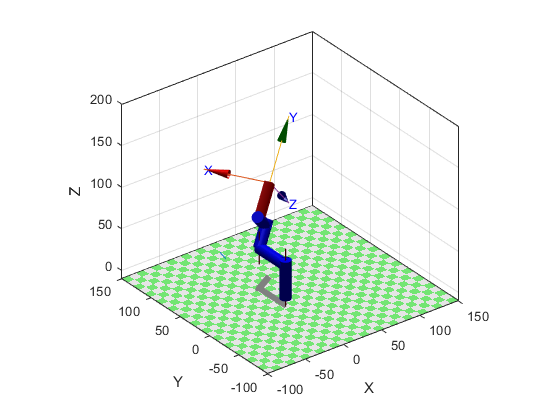

# Plotting Workspace and Trajectory in Matlab for a given Denavit-Hartenberg table

Tutorial for plotting Workspace and Trajectory of a Robot in Matlab using DH-table. 
In this example, the following table was used in order to simulate a robot:

| Joint | θi | ai | di | αi | Type |
| --- | --- | --- | ---| --- | --- |
| 1 | 90° | 0 | 40 | 0 | R |
| 2 | θ2 | 45 | 0 | 0 | R |
| 3 | 30° | 0 | 35 | 45° | R | 
| 4 | 0 | 0 | 40-60 | 90° |  P |

In this example, a 4-joint robot with 2 DOF is illustrated. The first joint is fixed, the secoind joint is a revolute joint (θ2), Joint 3 is fixed and Joint 4 is a prismatic joint which can vary from 40 to 60mm.
## Part 1 Plot Trajectory

Matlab code to plot a trajectory from a initial state `q0` to a final state `qf` as well as showing a graphical representation of a random robot. This code uses [Peter's Corke Matlab Toolbox](https://petercorke.com/toolboxes/robotics-toolbox/).

